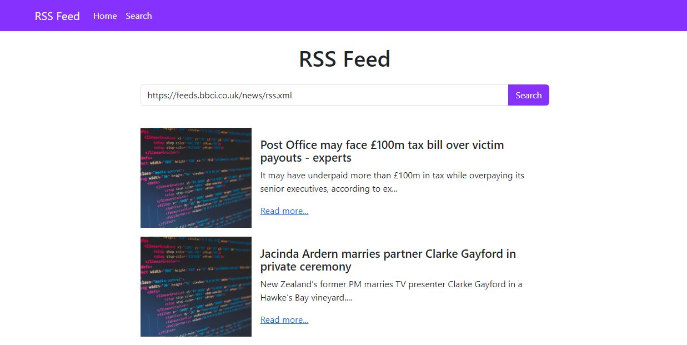

# RSS Feed Reader Website

Rss feed website is web application with an input field where user can enter feed url and get updated post feeds.
This is an open-source project from [DevProjects](http://www.codementor.io/projects). Feedback and questions are welcome!
Find the project requirements here: [RSS feed reader in terminal](https://www.codementor.io/projects/web/rss-feed-reader-website-atx32j280x)

## Tech/framework used

Built with Python , Django

## Screenshots and demo

Screenshots of your app and/or a link to your live demo


## Installation

Instructions for other developers on how to install and run your code on their local environment.

```bash
git clone https://github.com/fatimarazzaq/rss-feed-website

cd rss-feed-website

After creating fresh virtual environment
```

```bash
pip install -r requirements.txt
```

## Run the code

```bash
py manage.py runserver
```

## License

[MIT](https://choosealicense.com/licenses/mit/)
Most open source projects use the MIT license. Feel free to choose whichever license you prefer.

RSS feed reader is a terminal based python application in which we will get the feed from a url given as input from the terminal.
